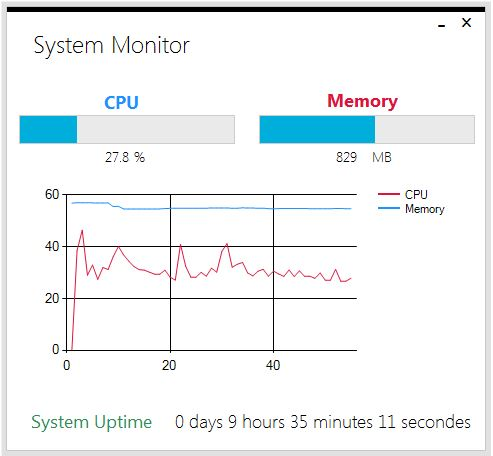

<h1 align = "center"> CPU-Memory-Monitor-WinForms </h1>

This is a windows application made using Windows Forms and MetroFramework UI. It display information about avaiable memory, how much used in CPU along with a chart. It also gives a speech warning to the user when too much system resources are being used.

  

